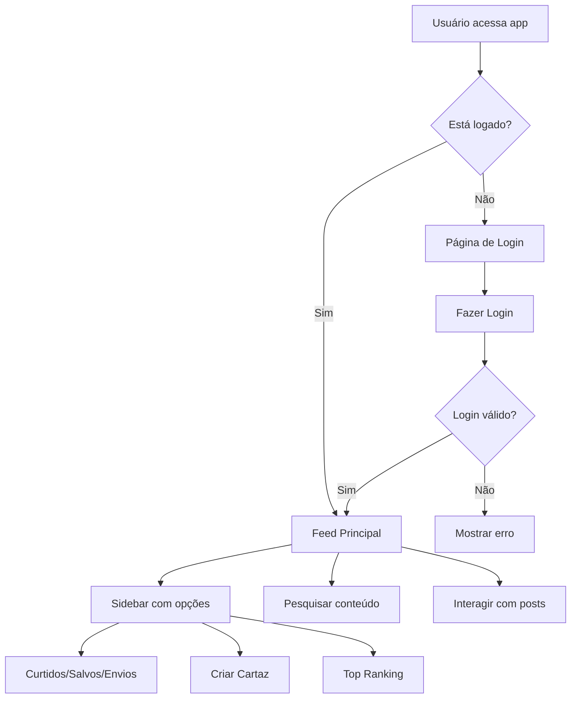

# Documento de Design - Sistema de Feed Social Roteirum

## Visão Geral

O Sistema de Feed Social do Roteirum será desenvolvido como uma Single Page Application (SPA) usando React, TypeScript e Tailwind CSS. A arquitetura seguirá padrões modernos de desenvolvimento frontend com componentes reutilizáveis, gerenciamento de estado local e integração futura com APIs.

## Arquitetura

### Estrutura de Componentes

```
src/
├── components/
│   ├── auth/
│   │   ├── LoginForm.tsx
│   │   └── AuthGuard.tsx
│   ├── feed/
│   │   ├── FeedContainer.tsx
│   │   ├── PostCard.tsx
│   │   ├── PostInteractions.tsx
│   │   └── SearchBar.tsx
│   ├── sidebar/
│   │   ├── Sidebar.tsx
│   │   ├── UserActions.tsx
│   │   └── TopRanking.tsx
│   └── ui/ (componentes existentes)
├── pages/
│   ├── Login.tsx
│   ├── Feed.tsx
│   ├── Profile.tsx
│   └── Ranking.tsx
├── types/
│   ├── User.ts
│   ├── Post.ts
│   └── index.ts
├── data/
│   ├── mockUsers.ts
│   ├── mockPosts.ts
│   └── authService.ts
└── hooks/
    ├── useAuth.tsx
    ├── usePosts.tsx
    └── useLocalStorage.tsx
```

### Fluxo de Navegação



## Componentes e Interfaces

### Componente de Autenticação

**LoginForm.tsx**
- Formulário simples com email e senha
- Validação básica de campos
- Integração com serviço de autenticação mock
- Feedback visual para estados de loading e erro

**AuthGuard.tsx**
- Higher-order component para proteger rotas
- Verifica estado de autenticação
- Redireciona para login se necessário

### Componentes do Feed

**FeedContainer.tsx**
- Container principal do feed
- Gerencia carregamento de posts
- Implementa scroll infinito
- Layout responsivo com grid

**PostCard.tsx**
- Exibe informações do post (título, autor, imagem, descrição)
- Botões de interação (curtir, salvar, comentar)
- Suporte para diferentes tipos de post (sinopse, cartaz, imagem IA)
- Design inspirado em cards do Facebook

**SearchBar.tsx**
- Barra de pesquisa centralizada no topo
- Sugestões em tempo real
- Filtros por tipo de conteúdo
- Histórico de pesquisas

### Componentes da Sidebar

**Sidebar.tsx**
- Menu lateral direito fixo
- Seções: Curtidos, Salvos, Seus Envios, Criar Cartaz
- Top Ranking do mês
- Design responsivo (colapsa em mobile)

**TopRanking.tsx**
- Lista dos top 100 posts do mês
- Ordenação por número de curtidas
- Paginação ou scroll infinito
- Indicadores visuais de posição

## Modelos de Dados

### User Model
```typescript
interface User {
  id: string;
  name: string;
  email: string;
  avatar?: string;
  bio?: string;
  createdAt: Date;
  isActive: boolean;
}
```

### Post Model
```typescript
interface Post {
  id: string;
  authorId: string;
  author: User;
  type: 'synopsis' | 'poster' | 'ai-image';
  title: string;
  content: string;
  imageUrl?: string;
  tags: string[];
  likes: number;
  likedBy: string[]; // user IDs
  saves: number;
  savedBy: string[]; // user IDs
  comments: Comment[];
  createdAt: Date;
  updatedAt: Date;
}

interface Comment {
  id: string;
  postId: string;
  authorId: string;
  author: User;
  content: string;
  createdAt: Date;
}
```

### Auth State
```typescript
interface AuthState {
  user: User | null;
  isAuthenticated: boolean;
  isLoading: boolean;
  error: string | null;
}
```

## Tratamento de Erros

### Estados de Erro
- **Erro de Autenticação**: Credenciais inválidas, sessão expirada
- **Erro de Carregamento**: Falha ao carregar posts, problemas de rede
- **Erro de Interação**: Falha ao curtir, salvar ou comentar
- **Erro de Pesquisa**: Falha na busca, resultados não encontrados

### Estratégias de Tratamento
- Toast notifications para feedback imediato
- Estados de loading com skeletons
- Retry automático para operações críticas
- Fallbacks para dados offline

## Estratégia de Testes

### Testes Unitários
- Componentes isolados com React Testing Library
- Hooks customizados com renderHook
- Funções utilitárias e serviços
- Validação de modelos de dados

### Testes de Integração
- Fluxos de autenticação completos
- Interações entre componentes
- Navegação entre páginas
- Estados de loading e erro

### Testes E2E (Futuros)
- Fluxo completo de login
- Criação e interação com posts
- Funcionalidades de pesquisa
- Responsividade mobile

## Layout e Design

### Estrutura da Página Principal
```
┌─────────────────────────────────────────────────────────┐
│                    Header/SearchBar                     │
├─────────────────────────────────────────────────────────┤
│           │                               │             │
│           │                               │  Sidebar    │
│           │         Feed Principal        │  - Curtidos │
│           │                               │  - Salvos   │
│           │                               │  - Envios   │
│           │                               │  - Criar    │
│           │                               │  - Ranking  │
│           │                               │             │
└─────────────────────────────────────────────────────────┘
```

### Responsividade
- **Desktop**: Layout de 3 colunas (espaço, feed, sidebar)
- **Tablet**: Layout de 2 colunas (feed, sidebar colapsável)
- **Mobile**: Layout de 1 coluna (sidebar como menu hambúrguer)

### Tema Visual
- Paleta de cores do Roteirum (gradientes cinema)
- Tipografia moderna e legível
- Ícones do Lucide React
- Animações suaves com Tailwind
- Cards com sombras e bordas arredondadas